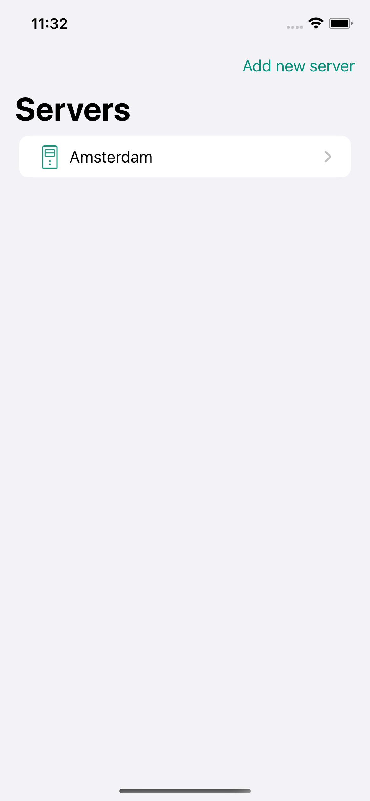
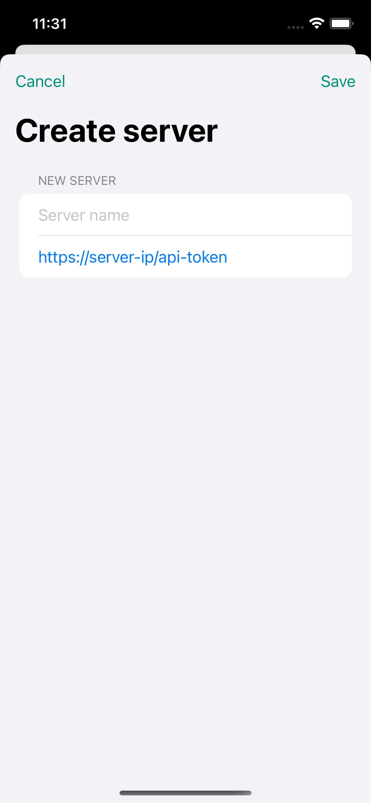
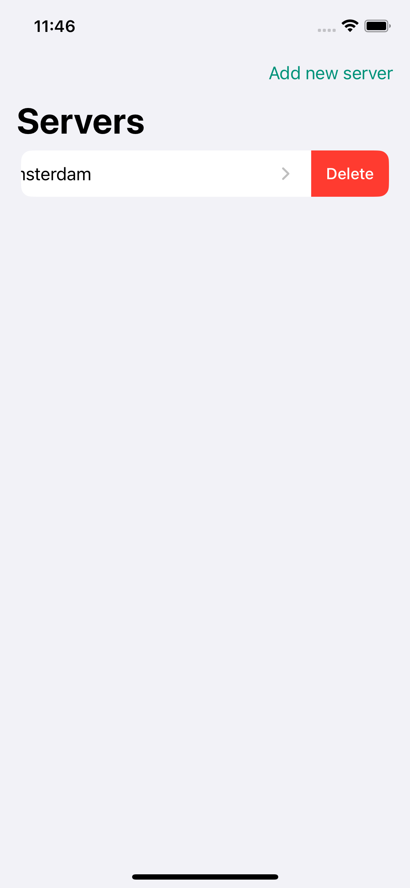
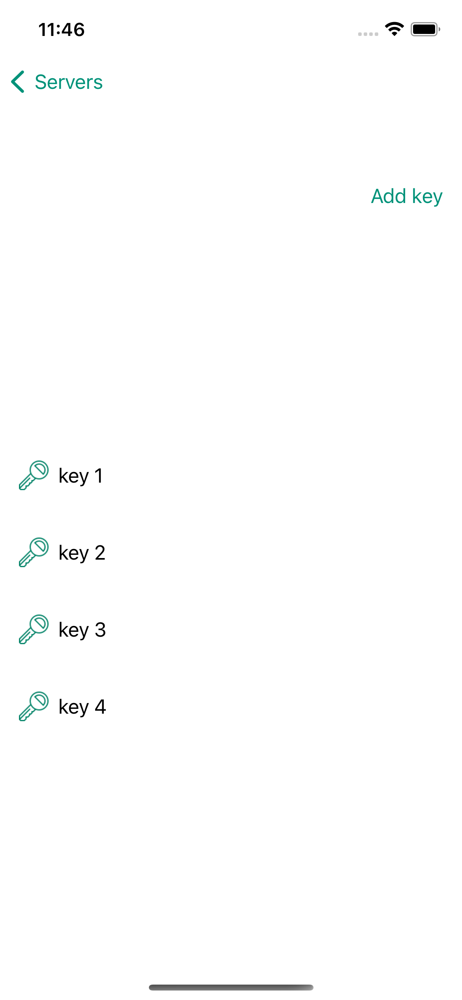
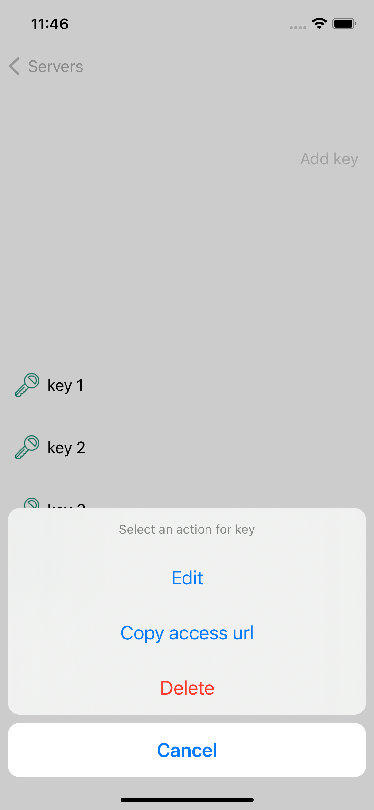
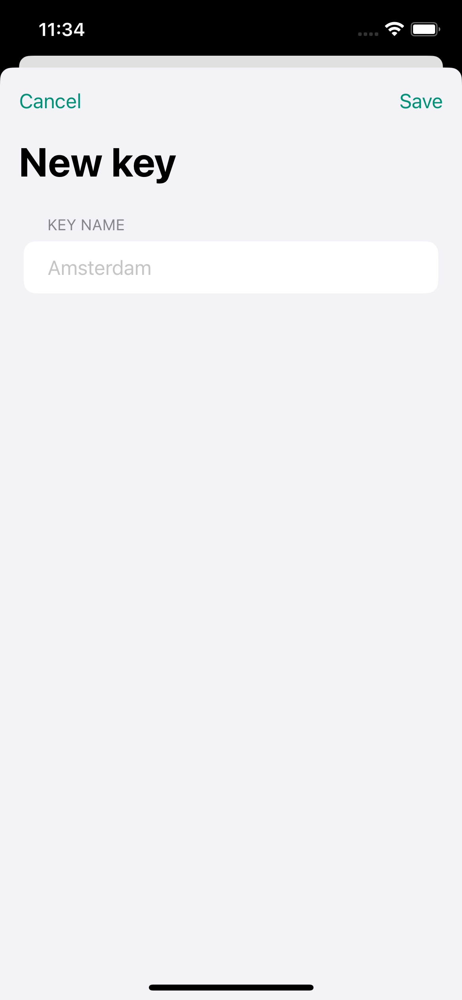
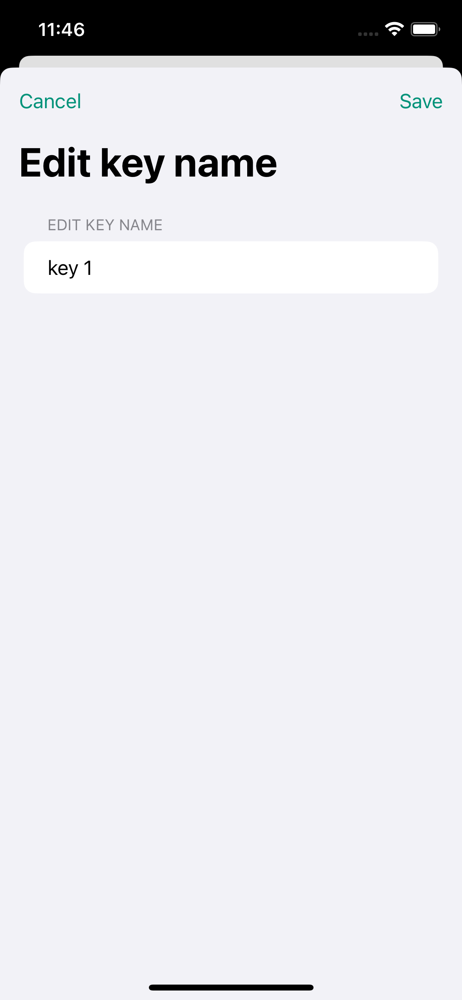

# outline-manager
simple ios outline manager

## Screens

### Servers

  
  &nbsp;&nbsp;&nbsp;&nbsp;&nbsp;
  
  &nbsp;&nbsp;&nbsp;&nbsp;&nbsp;
  

### Keys

  
  &nbsp;&nbsp;&nbsp;&nbsp;&nbsp;
  

  
  &nbsp;&nbsp;&nbsp;&nbsp;&nbsp;
  

